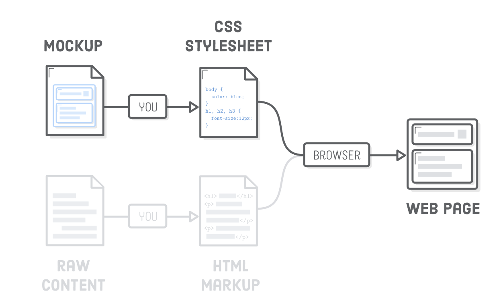
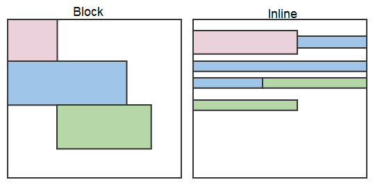
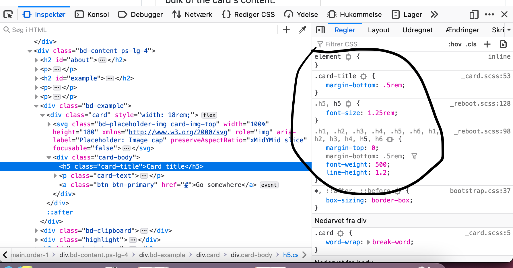

# CSS

CSS stands for cascading style sheets. It means the styles that are added for an element cascades down to their children. Its like a waterfall where the water will continue cascading down affecting the pools below.



## Adding css to your site

Create a css file. Fx `main.css`. To add the css to your html, add this line in the `head` of your html: `<link rel="stylesheet" href="main.css">`. Now the css file called `main.css` is connected to the html.

```markup
<head>
    <link rel="stylesheet" href="main.css">
</head>
```

## CSS selectors and properties

CSS has two parts:

1. The selector - specifies what html elements to style
2. The properties - specifies what style the html elements should get


It goes kind of like this: First we find the elements to style (the selector) then we tell how those selected elements should be be styled. Here is an example:

```css
h1 {
    color: red;
}
```

This reads like this: Select the `h1` html element. Now color the text red.

Lets go into more css selector details:

### CSS selector

#### Tag selector

Select all elements based on their tag name. Simply write the tag name

This selector

```css
h1 {
    color: red;
}
```

Would color the text `Hello` red `<h1>Hello</h1>`

```css
li {
    background-color: yellow;
}
```

Would give the `li` a yellow background color `<li>List item</li>`

#### Id selector

For id selectors use `#`

```css
#congratulation-message {
    background-color: red;
}
```

Will select an element like this:

`<div id="congratulation-message">Congratulations 🎉</div>`

#### Class selector

For class selectors use `.`

```css
.user-name {
    font-weight: bold;
}
```

Will select an element like this:

`<div class="user-name">Charlotte123</div>`

#### Descendant selector

You can make the selectors more specific by using the descendant selector:

```css
.intro h1 {
    font-size: 25px;
}
```

Style all `h1` elements that are descendants of the element with class name intro

```markup
<section> class="intro">
    <h1>Welcome to our wonderful site</h1>
</section>
```

You can also formulate it differently:

First find all the elements with a class of intro. Then find all the h1 tags that is descendants of the element with class intro.

#### And selector

Use the comma

```
section.intro, h1 {
    font-size: 25px;
}
```

Now you would give the section with class name intro **and** the `h1` a font size of 25 pixel.

#### Pseudo selector

use the `:`

```
.user-name:hover {
    color: purple;
}
```

Give the element with class user-name a color of purple when hovered with the mouse

There are **a lot** more but these are the most important ones. You can find more here: [https://developer.mozilla.org/en-US/docs/Web/CSS/Reference#selectors](https://developer.mozilla.org/en-US/docs/Web/CSS/Reference#selectors)

## CSS properties

[https://developer.mozilla.org/en-US/docs/Web/CSS/Reference](https://developer.mozilla.org/en-US/docs/Web/CSS/Reference)

A property in css is the styling you want to apply to an element. You write a property with the property name then `:` and then the value.

## CSS layout

CSS layouting decides how elements are layouts. What comes on top/to the left of what.

### Flow

CSS flow decides how elements are layed out. The flow can be changed with the `display` css property _show_.

#### Block flow

Elements that have block flow are stacked on top of each other.

These elements are fx `div`, `p`, `section`, `footer`

_Teacher note:_ Show with example

#### Inline flow

Elements that have inline flow are positioned next to each other.

That if fx `span`, `a`, `strong`.

_Teacher note:_ Show with example



### Positioning

#### Relative

Position an element **relative** to its original position.

```css
section .user-name {
    display: relative;
    left: 10px;
}
```

#### Absolute

Position an element in relation to the first parent that has a position set as a property. Text on top of and in the middle of an image.

```css
section .user-name {
    display: absolute;
    left: 10px;
}
```

Exercise: [https://www.w3schools.com/css/exercise.asp?filename=exercise\_positioning5](https://www.w3schools.com/css/exercise.asp?filename=exercise\_positioning5)

#### Fixed

A fixed element always appear at the same place on the screen no matter of someone scrolls! Imagine a cookie accept box.

```css
section .user-name {
    display: fixed;
    left: 10px;
}
```


### Flex

Flex is a relative new way of layouting things in the browser.

#### Flex container

Is where the `display: flex;` is applied. This will make all the **immediate children** flex items.

```markup
<div class="flex-container">
    <div class="box box-1">Flex item 1</div>
    <div class="box box-2">Flex item 2</div>
    <div class="box box-3">Flex item 3</div>
    <div class="box box-4">Flex item 4</div>
    <div class="box box-5">Flex item 5</div>
  </div>
```

When applying `display:flex;` the default direction of the flex items is row, meaning they will be positioned next to each other.

We can use the `justfy-content` to decide the spacing between the element in the flex direction. We can use `align-items` to decide the spacing in the other direction.

Now try and play around with `flex-direction` and with `justify-content` and `align-items`

[https://marina-ferreira.github.io/tutorials/css/flexbox/](https://marina-ferreira.github.io/tutorials/css/flexbox/)

[https://css-tricks.com/snippets/css/a-guide-to-flexbox/](https://css-tricks.com/snippets/css/a-guide-to-flexbox/)

## Bootstrap

Bootstrap is a css framework that helps you develop nice layouts and styling quickly. It basiscally works by adding specific elements with specific Bootstrap classes.

[https://getbootstrap.com](https://getbootstrap.com)

## Working with the inspector

You can see the css for any element on the web. Right click on the element and choose inspect element.

on the right hand side you can see the styles applied to the element you have inspected. In the `element` panel you can write your own css rules!


